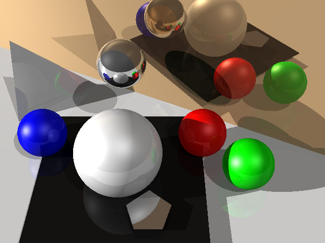

TinyRayTracer
=============

# Introduction #

A simple implemention of ray tracing.

# Build #

```
cd TinyRayTracer
mkdir build
cmake ..
make
```

**For Windows:** reference the [cmake for windows](https://cmake.org/).

# Run #

```
cd TinyRayTracer/bin
chmod +x tray #optional
./tray
```

The tray program will read the file 'world.txt' and generate a **ppm** image file 'output.ppm', which can be opened by **xnview** or **photoshop** or another ppm supported image viewer.

# Result #

